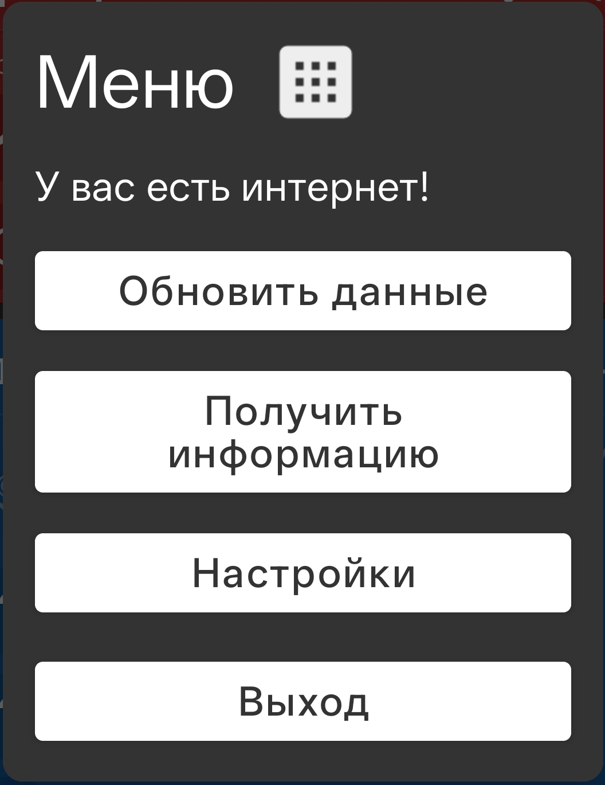

# Поезд станция

**Поезд станция** — это мини-приложение для MacroDroid, которое показывает информацию о следующей станции поезда. Особенно полезно в дороге.

Приложение работает через API [Яндекс Расписания](https://rasp.yandex.ru/).

## Оглавление

- [Поезд станция](#поезд-станция)
  - [Оглавление](#оглавление)
  - [Функции](#функции)
  - [Скриншоты](#скриншоты)
  - [Установка](#установка)
  - [Добавление ярлыка](#добавление-ярлыка)
  - [Настройка](#настройка)
  - [Выбор рейса](#выбор-рейса)

## Функции

1. Просмотр названия станции, времени до прибытия и времени стоянки на следующих станциях.
2. Быстрая настройка рейса.
3. Автообновляющееся уведомление с нужной информацией.
4. Работа без интернета.

## Скриншоты

## Установка

1. Установите MacroDroid ([Google Play](https://play.google.com/store/apps/details?id=com.arlosoft.macrodroid)).
2. Перейдите в раздел шаблоны и напишите в поиске Bober install или перейдите по [ссылке](https://www.macrodroidlink.com/macrostore?id=29429)
3. Нажмите на первый макрос
4. Нажмите кнопку + в правом нижнем углу экрана
5. Перейдите на главный экран macrodroid, а затем в раздел Макросы
6. Найдите Bober install и нажмте на него
7. Нажмите запущен ярлык -> Тестировать тригер -> Установить макросы -> Выберите макрос -> Меню выбора:Поезд станция -> Установить
3.
   Также могут появляться дополнительные уведомления с просьбой выдать разрешения — они нужны для корректной работы.
1. Установка завершена! Для удобного запуска добавьте [ярлык](#добавление-ярлыка) и не забудьте выполнить [настройку](#настройка).

## Добавление ярлыка

1. В приложении MacroDroid перейдите на вкладку **Макросы** (в нижней части экрана).
2. Выполните долгое нажатие по макросу **Поезд станция** (он выделен синим цветом).
3. Выберите: **Создать ярлык**.
4. Выберите иконку (необязательно).
5. Нажмите **ОК**.
6. Ярлык добавлен.

## Настройка

1. [Перейдите в кабинет разработчика Яндекса для создания API-ключа](https://developer.tech.yandex.ru/services/4).
2. Авторизуйтесь через Яндекс ID (если требуется).
3. Нажмите **Новый ключ** (правый верхний угол).
4. В появившемся окне укажите любое название, например: **Поезд станция**.
5. Скопируйте ключ.
6. Запустите макрос (см. [Добавление ярлыка](#добавление-ярлыка)).
7. Перейдите в настройки.
8. Вставьте полученный ключ в соответствующее поле.
9. Нажмите: **Выход**.
10. Ключ добавлен, макрос готов к использованию.

## Выбор рейса

1. Запустите макрос (см. [Добавление ярлыка](#добавление-ярлыка)).
2. Перейдите в настройки.
3. Нажмите: **Поиск рейсов**.
4. В первое поле введите станцию отправления — ту, на которой вы садитесь.
5. Во второе поле введите дату отправления в формате `2026-03-15` (дату вашей поездки).
6. Нажмите: **Искать**.
7. Дождитесь загрузки (появится название станции).
8. Используя стрелки, выберите вашу станцию отправления (точное название указано в билете) из найденных.
9. Нажмите: **Дальше**.
10. Введите название станции прибытия.
11. Нажмите: **Искать**.
12. Дождитесь загрузки (появится название станции).
13. Используя стрелки, выберите вашу станцию прибытия (точное название указано в билете) из найденных.
14. Появится загрузка — дождитесь завершения.
15. Выберите ваш рейс из найденных.
16. Завершите настройку.
17. Чтобы данные обновились: **Главное меню → Обновить данные → Подождать → Данные обновлены**.
